# LIRI-Node-App
A Language Interpretation and Recognition Interface. Powered by Node.js.

### Overview

This CLI app allows you to search for information about concerts, songs, and movies. In order to interpret the user's commands and return the requested information, LIRI makes use of the following technologies:

* a CLI, or command-line interface, such as Command Prompt or Git Bash
    - The user-end part of the app, the interface with which the user operates and communicates with LIRI. It is this app's counterpart to the browser used to access a website and, as such, is up to the user's personal preference.
* Node.js
    - The bridge between the CLI and the logic coded in JavaScript.
* JavaScript
    - The logic that determines LIRI's behavior and which links user inputs to the APIs from which the requested information is fetched.
* APIs
    - The application programming interfaces which provide the requested information. These include:
        * Bands in Town (for concert data)
        * Moment (to interpret dates and times retrieved from Bands in Town)
        * Spotify (for song data)
        * OMDb (for movie data)
* Axios
    - A node package used to retrieve data from the Bands in Town and OMDb APIs.

### Demo

1. Specify the path to the directory where LIRI is stored on your computer.
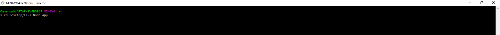

2. Within the LIRI directory, run LIRI with the command "node liri.js."
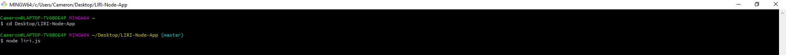

3. LIRI will greet you and give you some basic instructions.
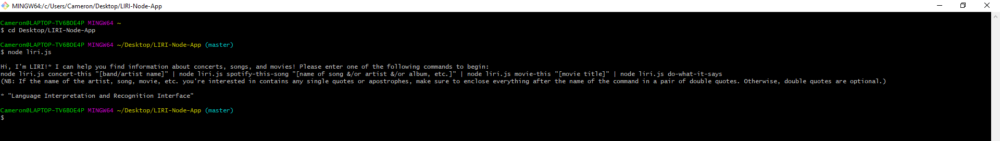

4. If you enter the command "concert-this" without specifying an artist, LIRI will offer a helpful reminder.
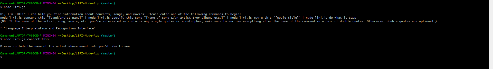

5. LIRI will also let you know if Bands in Town's database does not include any artists going by the name in question as you have spelled it.
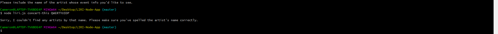

6. If Bands in Town recognizes the artist whose name you have entered but, for whatever reason, that artist does not have any known upcoming events, LIRI will say so.
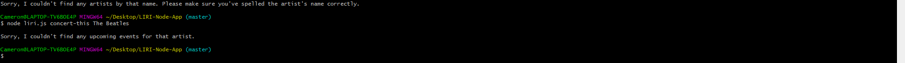

7. If the artist has any known upcoming events, all of those events will be listed in the following format: venue name, followed by venue location, and finally the date and time of the event.
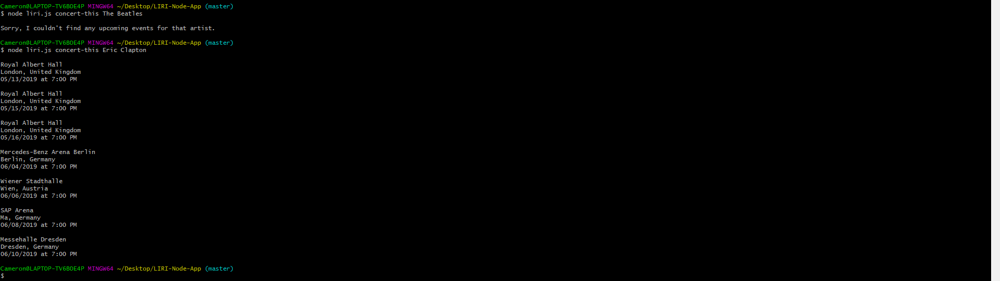

8. If you enter the command "spotify-this-song" without specifying a song, LIRI will share her favorite song with you.
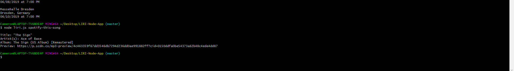

9. If you do specify a song, LIRI will show you the top result and give you its title, artist(s), album, and Spotify preview.
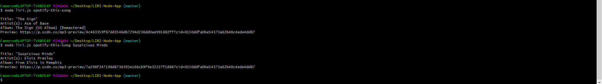

10. If you enter the command "movie-this" without specifying a movie, LIRI will share her favorite movie with you.
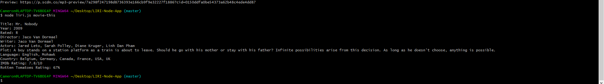

11. If you do specify a movie, LIRI will show you OMDb's top result and give you a great deal of information about it.
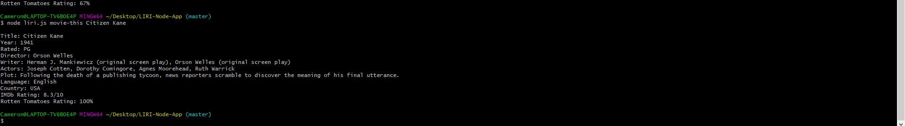

12. In the "random.txt" file, you can hide a surprise "concert-this," "spotify-this-song," or "movie-this" command.
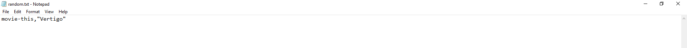

13. To have LIRI execute the "random.txt" command, simply instruct her to "do-what-it-says."
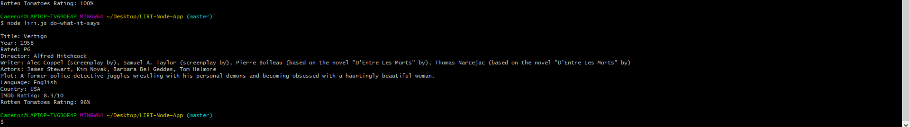

14. LIRI's responses are stored in the "log.txt" file, so you can still refer to them even after closing or clearing your CLI.
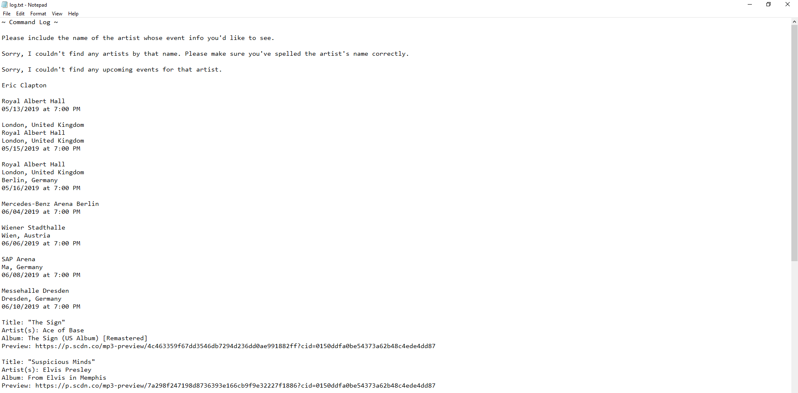

15. Does this movie info look familiar?
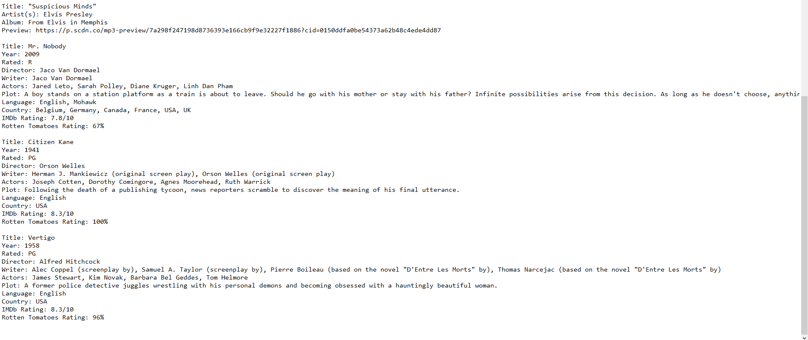
